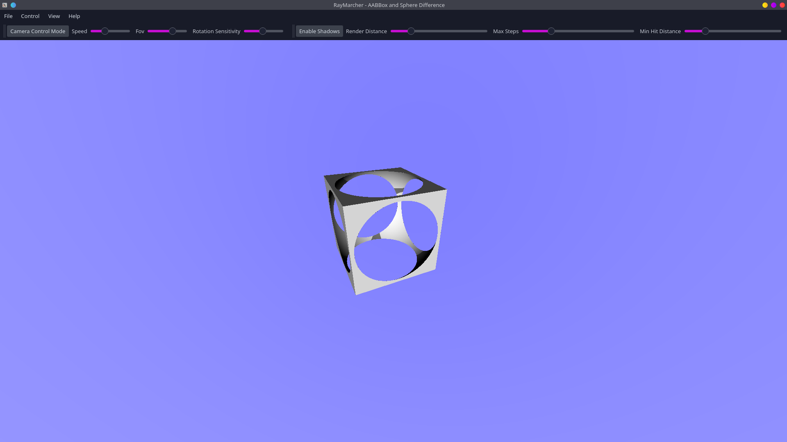
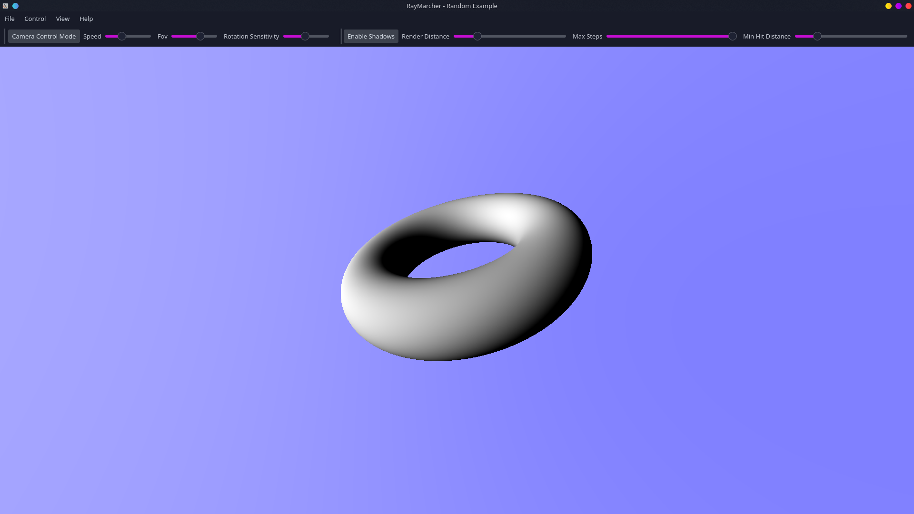
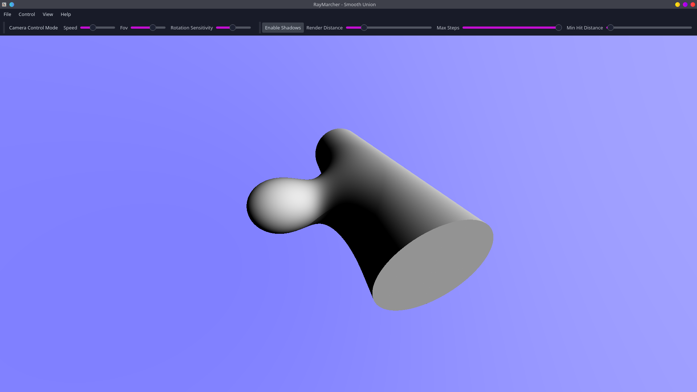
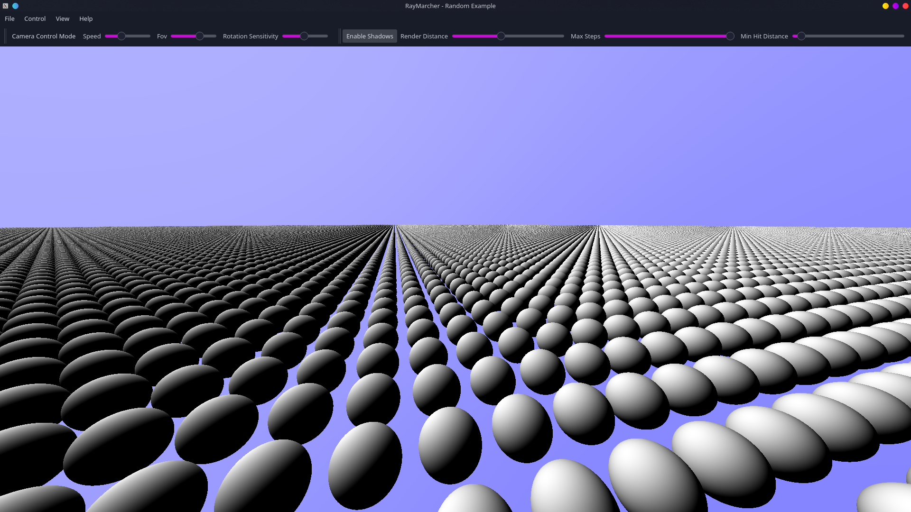

# RayMarcher
The simple program which uses single fragment shader with ray marching written with [Qt](https://www.qt.io).
Using [raymarching.py](https://github.com/NamorNiradnug/raymarching.py) is recommended for writing scenes for RayMarcher.
## Installation
RayMarcher requires `make`, `cmake` and `qt5` for compiling and `python3` for running.
## Examples screenshots
Cube and sphere difference.

Torus.

"Smooth union".

Infinite spheres world.

Random example contains scene which usually demonstraits new features.
## TODO
 - More properties in scene
    - Lighting
    - Camera position
    - Variables & functions
 - Smooth shadows
